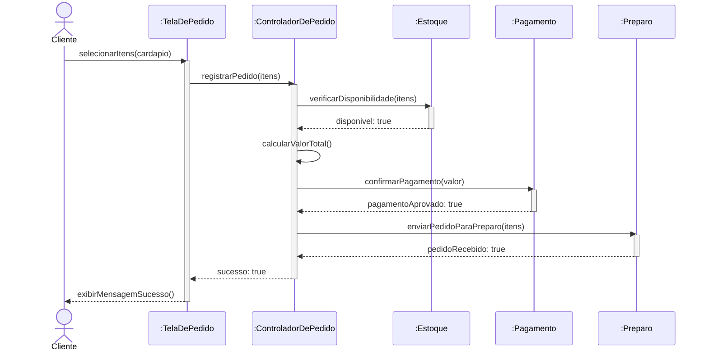

```mermaid
sequenceDiagram
    actor Cliente
    participant TelaDePedido as :TelaDePedido
    participant ControladorDePedido as :ControladorDePedido
    participant Estoque as :Estoque
    participant Pagamento as :Pagamento
    participant Preparo as :Preparo

    Cliente->>TelaDePedido: selecionarItens(cardapio)
    activate TelaDePedido
    TelaDePedido->>ControladorDePedido: registrarPedido(itens)
    activate ControladorDePedido

    ControladorDePedido->>Estoque: verificarDisponibilidade(itens)
    activate Estoque
    Estoque-->>ControladorDePedido: disponivel: true
    deactivate Estoque

    ControladorDePedido->>ControladorDePedido: calcularValorTotal()

    ControladorDePedido->>Pagamento: confirmarPagamento(valor)
    activate Pagamento
    Pagamento-->>ControladorDePedido: pagamentoAprovado: true
    deactivate Pagamento

    ControladorDePedido->>Preparo: enviarPedidoParaPreparo(itens)
    activate Preparo
    Preparo-->>ControladorDePedido: pedidoRecebido: true
    deactivate Preparo

    ControladorDePedido-->>TelaDePedido: sucesso: true
    deactivate ControladorDePedido
    TelaDePedido-->>Cliente: exibirMensagemSucesso()
    deactivate TelaDePedido
```