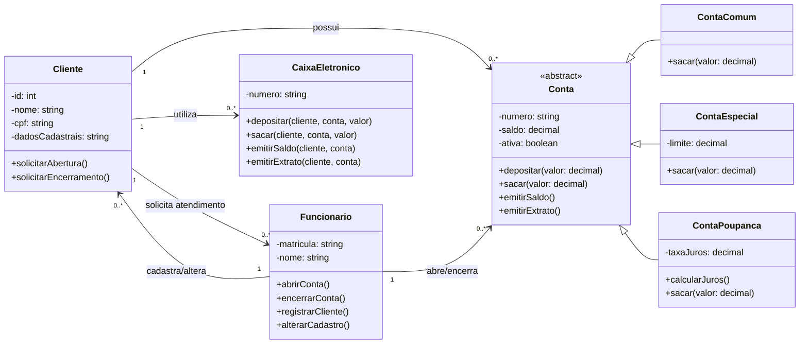

```mermaid

classDiagram
    direction LR

    class Cliente {
        -id: int
        -nome: string
        -cpf: string
        -dadosCadastrais: string
        +solicitarAbertura()
        +solicitarEncerramento()
    }

    class Funcionario {
        -matricula: string
        -nome: string
        +abrirConta()
        +encerrarConta()
        +registrarCliente()
        +alterarCadastro()
    }

    class Conta {
        <<abstract>>
        -numero: string
        -saldo: decimal
        -ativa: boolean
        +depositar(valor: decimal)
        +sacar(valor: decimal)
        +emitirSaldo()
        +emitirExtrato()
    }

    class ContaComum {
        +sacar(valor: decimal)
    }

    class ContaEspecial {
        -limite: decimal
        +sacar(valor: decimal)
    }

    class ContaPoupanca {
        -taxaJuros: decimal
        +calcularJuros()
        +sacar(valor: decimal)
    }

    class CaixaEletronico {
        -numero: string
        +depositar(cliente, conta, valor)
        +sacar(cliente, conta, valor)
        +emitirSaldo(cliente, conta)
        +emitirExtrato(cliente, conta)
    }

    Cliente "1" --> "0..*" Conta : possui
    Cliente "1" --> "0..*" CaixaEletronico : utiliza
    Cliente "1" --> "0..*" Funcionario : solicita atendimento
    Funcionario "1" --> "0..*" Cliente : cadastra/altera
    Funcionario "1" --> "0..*" Conta : abre/encerra

    Conta <|-- ContaComum
    Conta <|-- ContaEspecial
    Conta <|-- ContaPoupanca
```