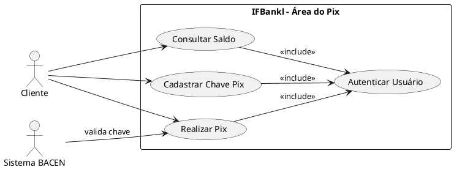
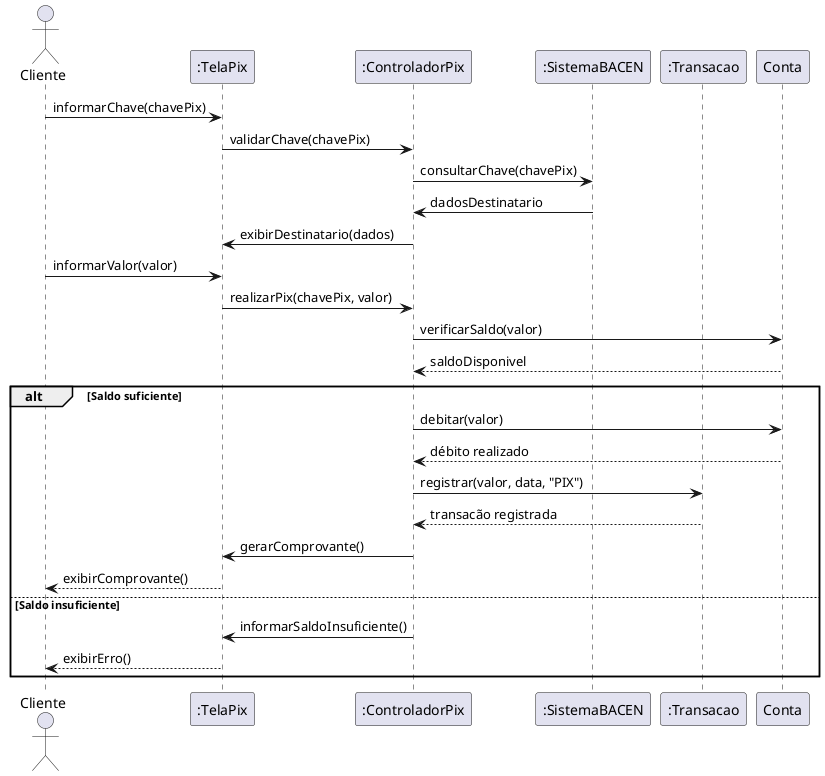
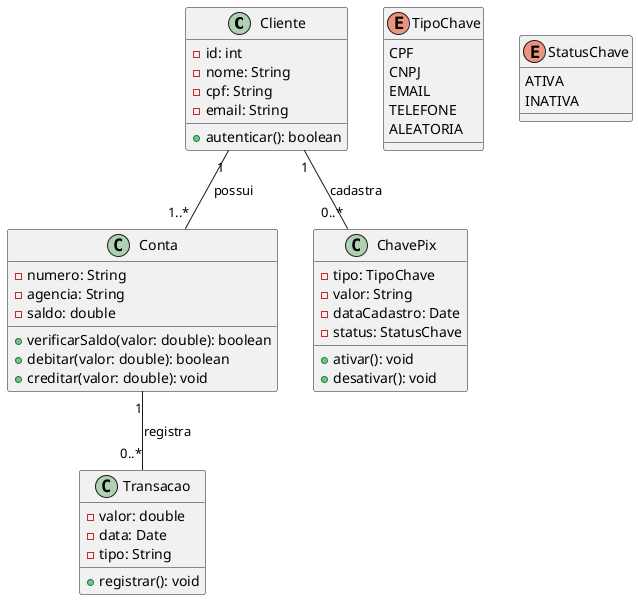

# Dossiê de Análise — Módulo Pix (IFBank)

Trabalho de análise sobre a área de Pix do app IFBank, juntando casos de uso, sequência e classes.

---

## Etapa 1 — Casos de Uso

### A. Diagrama

O Cliente usa três funções: `Consultar Saldo`, `Cadastrar Chave Pix` e `Realizar Pix`. O Sistema BACEN só entra em `Realizar Pix`, para checar se a chave existe. Já o `Autenticar Usuário` não é usado direto pelo Cliente — ele acontece sozinho toda vez que o Cliente usa qualquer uma das outras três funções (por isso o `<<include>>`), já que o app exige login antes de qualquer coisa.

**Código PlantUML:**

### B. Realizar Pix — como funciona

**Quem participa:** Cliente e Sistema BACEN

**Antes de começar:**
- Cliente já logado no app
- Cliente tem conta ativa
- Cliente tem saldo pra fazer a transferência

**Passo a passo:**
1. Cliente clica em Realizar Pix.
2. Cliente digita a chave de quem vai receber.
3. O app manda essa chave pro BACEN pra ver se existe.
4. O BACEN devolve o nome de quem vai receber, e o app mostra na tela.
5. Cliente digita o valor.
6. O app checa se tem saldo suficiente.
7. Cliente confirma.
8. O app tira o dinheiro da conta do Cliente.
9. O app salva essa transação no extrato.
10. O app mostra o comprovante na tela.

**Quando dá errado:**

**[FE-01] Sem saldo**
- Acontece no passo 6, se o saldo for menor que o valor digitado.
- O app mostra "Saldo insuficiente" e cancela a transação.

**[FE-02] Chave errada**
- Acontece no passo 3, se o BACEN não achar essa chave.
- O app mostra "Chave não encontrada" e deixa o Cliente digitar outra.

**[FE-03] BACEN não responde**
- Acontece no passo 3, se o BACEN demorar demais pra responder.
- O app mostra "Não foi possível validar agora, tente de novo" e cancela.

**No final:** conta debitada, transação salva no extrato e comprovante na tela.

---

## Etapa 2 — Diagrama de Sequência

Mostra como a tela, o controlador, a conta e o BACEN trocam mensagens durante o Realizar Pix. O bloco `alt/else` separa o que acontece quando tem saldo e quando não tem.

**Código PlantUML:**

---

## Etapa 3 — Diagrama de Classes

As classes que dão suporte a tudo que foi mostrado antes.

**Como as classes se conectam:**
- Um `Cliente` pode ter uma ou várias `Conta`.
- Uma `Conta` pode ter várias `ChavePix` cadastradas.
- Uma `Conta` guarda várias `Transacao` no extrato.
- Cada `Transacao` usa uma `ChavePix` como destino.
- Os atributos são privados (`-`); os métodos usados no diagrama de sequência (`debitar`, `creditar`, `verificarSaldo`) são públicos (`+`) na classe `Conta`.

**Código PlantUML:**

---